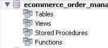
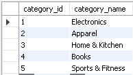
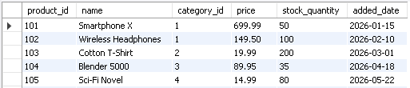
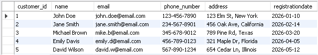
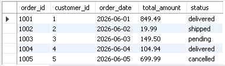
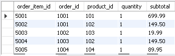
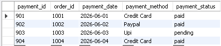
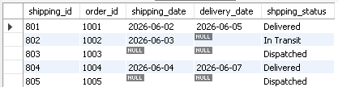
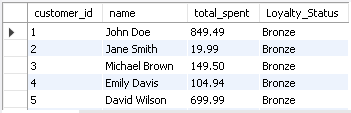
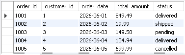

<div align="center">

# 🛒 E-Commerce Order Management System


<br>


<br><br>

*An SQL-based E-Commerce Order Management System demonstrating relational database design, order processing, data management, analytical queries, data transformation, and advanced SQL concepts using MySQL.*

</div>

---

# 📖 Project Overview

**E-Commerce Order Management System** is a SQL-based relational database project designed to manage the core operations of an online shopping platform.

The project manages **Categories, Products, Customers, Orders, Order Items, Payments, and Shipping** through interconnected relational tables.

It demonstrates how SQL can be used to create and manage an e-commerce database, maintain relationships between different entities, perform CRUD operations, retrieve business information, analyze sales data, and generate meaningful insights using SQL functions.

The project covers SQL concepts ranging from basic database creation and data insertion to advanced topics such as **JOINs, subqueries, aggregate functions, date functions, string functions, window functions, COALESCE, NULLIF, and CASE expressions**.

---

# 🎯 Objectives

* Learn relational database design using MySQL.
* Create a structured E-Commerce database.
* Understand Primary Keys and Foreign Keys.
* Manage product and category information.
* Store and manage customer details.
* Manage customer orders and order items.
* Track payment information.
* Manage shipping and delivery details.
* Perform CRUD operations using SQL.
* Apply different types of SQL JOINs.
* Use aggregate functions for business analysis.
* Work with nested queries and subqueries.
* Transform data using string and date functions.
* Handle NULL values using COALESCE and NULLIF.
* Analyze records using window functions.
* Rank customers based on spending.
* Calculate cumulative revenue and running order counts.
* Categorize customers and products using CASE statements.

---

# ✨ Project Highlights

* ✔ Created a complete E-Commerce relational database.
* ✔ Implemented **7 interconnected tables**.
* ✔ Used Primary Keys and Foreign Keys.
* ✔ Added product categories and product information.
* ✔ Added customer registration and contact information.
* ✔ Managed customer orders and order items.
* ✔ Added multiple payment methods and payment statuses.
* ✔ Added shipping and delivery tracking.
* ✔ Performed INSERT, UPDATE, and DELETE operations.
* ✔ Retrieved records using filtering and sorting.
* ✔ Used INNER JOIN, LEFT JOIN, and RIGHT JOIN.
* ✔ Applied nested queries and subqueries.
* ✔ Used aggregate functions such as SUM(), AVG(), and COUNT().
* ✔ Applied date and string functions.
* ✔ Used COALESCE() and NULLIF() for data handling.
* ✔ Implemented DENSE_RANK() for customer ranking.
* ✔ Generated cumulative revenue using window functions.
* ✔ Generated running order counts.
* ✔ Categorized customers using CASE expressions.
* ✔ Categorized products based on sales performance.
* ✔ Performed business-oriented data analysis.

---

# 🛠️ Technologies Used

| Technology          | Purpose                          |
| ------------------- | -------------------------------- |
| MySQL               | Database Management System       |
| SQL                 | Query Language                   |
| MySQL Workbench     | Database Development Environment |
| Relational Database | Data Storage                     |
| JOINs               | Combining Related Tables         |
| Aggregate Functions | Business Calculations            |
| Date Functions      | Date Analysis                    |
| String Functions    | Text Transformation              |
| Window Functions    | Advanced Data Analysis           |
| CASE Expressions    | Data Categorization              |

---

# 📂 Project Structure

```text
ECommerce_Order_Management_System/
│
├── SQL Script.sql
├── README.md
│
└── Screenshots/
    ├── Database.png
    ├── Categories_Table.png
    ├── Products_Table.png
    ├── Customers_Table.png
    ├── Orders_Table.png
    ├── Order_Items_Table.png
    ├── Payments_Table.png
    ├── Shipping_Table.png
    ├── Inner_Join.png
    ├── Left_Right_Join.png
    ├── Subquery.png
    ├── Date_Functions.png
    ├── String_Functions.png
    ├── Aggregate_Functions.png
    ├── Window_Functions.png
    └── Case_Statement.png
```

---

# 🗃️ Database Information

| Information      | Details                                          |
| ---------------- | ------------------------------------------------ |
| Database Name    | ECommerce_Order_Management_System                |
| Database Type    | Relational Database                              |
| Language         | SQL                                              |
| DBMS             | MySQL                                            |
| Development Tool | MySQL Workbench                                  |
| Number of Tables | 7                                                |
| Domain           | E-Commerce                                       |
| Main Operations  | Orders, Products, Customers, Payments & Shipping |

---

# 🗄️ Database Tables

The database consists of **seven interconnected relational tables** designed to represent the major components of an E-Commerce platform.

---

## 🏷️ Categories Table

Stores product category information.

| Column Name   | Data Type   | Description                      |
| ------------- | ----------- | -------------------------------- |
| category_id   | INT         | Unique Category ID (Primary Key) |
| category_name | VARCHAR(50) | Name of Product Category         |

### Sample Categories

* Electronics
* Apparel
* Home & Kitchen
* Books
* Sports & Fitness

---

## 📦 Products Table

Stores product information, pricing, stock, and category relationships.

| Column Name    | Data Type     | Description                     |
| -------------- | ------------- | ------------------------------- |
| product_id     | INT           | Unique Product ID (Primary Key) |
| name           | VARCHAR(50)   | Product Name                    |
| category_id    | INT           | References Categories Table     |
| price          | DECIMAL(10,2) | Product Price                   |
| stock_quantity | INT           | Available Stock                 |
| added_date     | DATE          | Product Added Date              |

**Relationship:**

`Products.category_id → Categories.category_id`

---

## 👥 Customers Table

Stores customer registration and contact information.

| Column Name      | Data Type   | Description                      |
| ---------------- | ----------- | -------------------------------- |
| customer_id      | INT         | Unique Customer ID (Primary Key) |
| name             | VARCHAR(50) | Customer Name                    |
| email            | VARCHAR(50) | Customer Email                   |
| phone_number     | VARCHAR(20) | Customer Phone Number            |
| address          | VARCHAR(50) | Customer Address                 |
| registrationdate | DATE        | Customer Registration Date       |

---

## 🛒 Orders Table

Stores order information placed by customers.

| Column Name  | Data Type     | Description                   |
| ------------ | ------------- | ----------------------------- |
| order_id     | INT           | Unique Order ID (Primary Key) |
| customer_id  | INT           | References Customers Table    |
| order_date   | DATE          | Date of Order                 |
| total_amount | DECIMAL(10,2) | Total Order Amount            |
| status       | ENUM          | Order Status                  |

### Order Status

* pending
* shipped
* delivered
* cancelled

**Relationship:**

`Orders.customer_id → Customers.customer_id`

---

## 🧾 Orders_Items Table

Stores individual products included in customer orders.

| Column Name   | Data Type     | Description               |
| ------------- | ------------- | ------------------------- |
| order_item_id | INT           | Unique Order Item ID      |
| order_id      | INT           | References Orders Table   |
| product_id    | INT           | References Products Table |
| quantity      | INT           | Quantity Ordered          |
| subtotal      | DECIMAL(10,2) | Item Subtotal             |

**Relationships:**

`Orders_Items.order_id → Orders.order_id`

`Orders_Items.product_id → Products.product_id`

---

## 💳 Payments Table

Stores payment information for customer orders.

| Column Name    | Data Type | Description             |
| -------------- | --------- | ----------------------- |
| payment_id     | INT       | Unique Payment ID       |
| order_id       | INT       | References Orders Table |
| payment_date   | DATE      | Payment Date            |
| payment_method | ENUM      | Payment Method          |
| payment_status | ENUM      | Payment Status          |

### Payment Methods

* Credit Card
* Paypal
* Upi

### Payment Status

* paid
* pending
* failed

**Relationship:**

`Payments.order_id → Orders.order_id`

---

## 🚚 Shipping Table

Stores shipping and delivery information.

| Column Name    | Data Type | Description             |
| -------------- | --------- | ----------------------- |
| shipping_id    | INT       | Unique Shipping ID      |
| order_id       | INT       | References Orders Table |
| shipping_date  | DATE      | Shipping Date           |
| delivery_date  | DATE      | Delivery Date           |
| shpping_status | ENUM      | Shipping Status         |

### Shipping Status

* Dispatched
* In Transit
* Delivered

**Relationship:**

`Shipping.order_id → Orders.order_id`

---

# 🔗 Database Relationships

The database uses foreign keys to establish relationships between the tables.

```text
Categories
    │
    │ category_id
    ▼
Products
    │
    │ product_id
    ▼
Orders_Items
    ▲
    │ order_id
    │
Orders ───────────► Payments
  ▲                    │
  │                    │ order_id
  │                    ▼
Customers           Payment Details

Orders
  │
  │ order_id
  ▼
Shipping
```

### Main Relationships

* Categories → Products
* Customers → Orders
* Orders → Orders_Items
* Products → Orders_Items
* Orders → Payments
* Orders → Shipping

---

# 📊 Sample Data

The database contains sample records for testing and demonstrating SQL operations.

## 🏷️ Categories

| Category ID | Category Name    |
| ----------- | ---------------- |
| 1           | Electronics      |
| 2           | Apparel          |
| 3           | Home & Kitchen   |
| 4           | Books            |
| 5           | Sports & Fitness |

---

## 📦 Products

| Product ID | Product             | Category       |   Price | Stock |
| ---------- | ------------------- | -------------- | ------: | ----: |
| 101        | Smartphone X        | Electronics    |  699.99 |    50 |
| 102        | Wireless Headphones | Electronics    |  149.50 |   120 |
| 103        | Cotton T-Shirt      | Apparel        |   19.99 |   200 |
| 104        | Blender 5000        | Home & Kitchen |   89.95 |    35 |
| 105        | Sci-Fi Novel        | Books          |   14.99 |    80 |
| 106        | Wireless Headphones | Electronics    | 2999.00 |    50 |

---

## 👥 Customers

The project contains customer records such as:

* John Doe
* Jane Smith
* Michael Brown
* Emily Davis
* David Wilson
* Sarth Thakar

---

## 🛒 Orders

The project contains orders with different statuses:

* Delivered
* Shipped
* Pending
* Cancelled

---

# ✨ Project Features

## 🏗️ Database Design

* Designed a relational E-Commerce database.
* Created seven interconnected tables.
* Applied Primary Key constraints.
* Applied Foreign Key constraints.
* Used ENUM fields for controlled status and payment values.
* Created relationships between business entities.

---

## 📥 Data Management

The project demonstrates data insertion using `INSERT INTO`.

Examples include:

* Adding categories.
* Adding products.
* Registering customers.
* Creating orders.
* Adding order items.
* Recording payments.
* Recording shipping information.

---

## ✏️ Data Modification

The project also demonstrates data modification operations.

### UPDATE

```sql
UPDATE products
SET stock_quantity = 100
WHERE product_id = 102;
```

### DELETE

The project includes a DELETE operation for removing payments associated with cancelled orders older than 30 days.

---

## 🔍 Data Retrieval

The project performs multiple data retrieval operations using:

* SELECT
* WHERE
* ORDER BY
* LIMIT
* DISTINCT
* GROUP BY
* HAVING

Examples include:

* Finding products with available stock.
* Finding recent orders.
* Sorting products by price.
* Counting orders per customer.
* Finding customers with multiple orders.

---

# 🔗 SQL JOIN Operations

The project demonstrates multiple JOIN operations for combining related information.

## INNER JOIN

Used to retrieve products along with their category names.

```sql
SELECT products.product_id,
       products.name AS product_name,
       categories.category_name
FROM products
INNER JOIN categories
ON products.category_id = categories.category_id;
```

---

## LEFT JOIN

Used to retrieve orders along with customer information.

```sql
SELECT Orders.order_id,
       Orders.order_date,
       Orders.total_amount,
       customers.name AS customer_name,
       customers.email
FROM Orders
LEFT JOIN customers
ON Orders.customer_id = customers.customer_id;
```

---

## RIGHT JOIN

Used to identify orders where shipping information is missing or not yet delivered.

```sql
SELECT Orders.order_id,
       Orders.status,
       Shipping.shipping_id,
       Shipping.shpping_status
FROM Shipping
RIGHT JOIN Orders
ON Shipping.order_id = Orders.order_id
WHERE Shipping.shpping_status != 'Delivered'
   OR Shipping.shpping_status IS NULL;
```

---

# 🔍 Subqueries

The project uses nested queries for advanced filtering and analysis.

Examples include:

* Finding orders from customers registered after a specific year.
* Finding the customer who spent the most.
* Finding products that have never appeared in order items.

Example:

```sql
SELECT *
FROM products
WHERE product_id NOT IN (
    SELECT DISTINCT product_id
    FROM Orders_Items
);
```

This query identifies products that have not been included in any order items.

---

# 📈 Aggregate Functions

The project uses aggregate functions to calculate business metrics.

### Total Revenue

```sql
SELECT SUM(total_amount) AS total_revenue
FROM Orders;
```

### Average Order Value

```sql
SELECT AVG(total_amount) AS average_order_value
FROM Orders;
```

### Total Orders Per Customer

```sql
SELECT customer_id,
       COUNT(order_id) AS Total_Orders
FROM Orders
GROUP BY customer_id;
```

### Category Revenue

```sql
SELECT categories.category_id,
       categories.category_name,
       SUM(Orders_Items.subtotal) AS total_revenue
FROM categories
JOIN products
ON categories.category_id = products.category_id
JOIN Orders_Items
ON products.product_id = Orders_Items.product_id
GROUP BY category_id, categories.category_name;
```

---

# 📅 Date Functions

The project uses MySQL date functions for order, shipping, and customer analysis.

| Function      | Purpose                             |
| ------------- | ----------------------------------- |
| CURDATE()     | Returns Current Date                |
| YEAR()        | Extracts Year                       |
| MONTH()       | Extracts Month                      |
| MONTHNAME()   | Returns Month Name                  |
| DATEDIFF()    | Calculates Difference Between Dates |
| DATE_SUB()    | Subtracts Time Interval             |
| DATE_FORMAT() | Formats Date                        |

### Example

```sql
SELECT order_id,
       DATE_FORMAT(order_date, '%d-%m-%Y') AS formatted_order_date
FROM Orders;
```

### Delivery Time Calculation

```sql
SELECT shipping_id,
       order_id,
       DATEDIFF(delivery_date, shipping_date) AS delivery_time_days
FROM Shipping
WHERE delivery_date IS NOT NULL;
```

---

# 🔤 String Functions

The project demonstrates SQL string transformation functions.

| Function   | Purpose                          |
| ---------- | -------------------------------- |
| UPPER()    | Converts Text to Uppercase       |
| TRIM()     | Removes Extra Spaces             |
| NULLIF()   | Converts Matching Values to NULL |
| COALESCE() | Provides a Default Value         |

### Uppercase Product Names

```sql
SELECT UPPER(name) AS uppercase_product_name
FROM products;
```

### Clean Customer Names

```sql
SELECT TRIM(name) AS clean_customer_name
FROM customers;
```

### Handling Missing Emails

```sql
SELECT customer_id,
       name,
       COALESCE(NULLIF(email, ''), 'Not Provided') AS email
FROM customers;
```

---

# 📊 Window Functions

Advanced SQL window functions are used for analytical operations.

## Customer Ranking

Customers are ranked based on their total spending.

```sql
SELECT customer_id,
       SUM(total_amount) AS total_spent,
       DENSE_RANK() OVER (
           ORDER BY SUM(total_amount) DESC
       ) AS customer_rank
FROM Orders
GROUP BY customer_id;
```

---

## Cumulative Revenue

The project calculates cumulative revenue based on order dates.

```sql
SELECT order_date,
       total_amount,
       SUM(total_amount) OVER (
           ORDER BY order_date
       ) AS cumulative_revenue
FROM Orders;
```

---

## Running Order Count

```sql
SELECT order_id,
       order_date,
       COUNT(order_id) OVER (
           ORDER BY order_date
       ) AS running_order_count
FROM Orders;
```

---

# 🎯 CASE Expressions

CASE statements are used to categorize customers and products.

## Customer Loyalty Status

Customers are categorized according to their total spending.

```sql
SELECT c.customer_id,
       c.name,
       COALESCE(SUM(o.total_amount), 0) AS total_spent,
       CASE
           WHEN SUM(o.total_amount) > 50000
               THEN 'Gold'
           WHEN SUM(o.total_amount) BETWEEN 20000 AND 50000
               THEN 'Silver'
           ELSE 'Bronze'
       END AS Loyalty_Status
FROM Customers c
LEFT JOIN Orders o
ON c.customer_id = o.customer_id
GROUP BY c.customer_id, c.name;
```

### Loyalty Categories

| Spending        | Status |
| --------------- | ------ |
| Above 50,000    | Gold   |
| 20,000 – 50,000 | Silver |
| Below 20,000    | Bronze |

---

## Product Sales Category

Products are categorized according to units sold.

```sql
SELECT product_id,
       name,
       COALESCE(SUM(quantity), 0) AS total_units_sold,
       CASE
           WHEN SUM(quantity) > 500
               THEN 'Best Seller'
           WHEN SUM(quantity) BETWEEN 200 AND 500
               THEN 'Popular'
           ELSE 'Regular'
       END AS product_category
FROM Products
LEFT JOIN Orders_Items
ON products.product_id = Orders_Items.product_id
GROUP BY product_id, name;
```

### Product Categories

| Units Sold | Category    |
| ---------- | ----------- |
| Above 500  | Best Seller |
| 200 – 500  | Popular     |
| Below 200  | Regular     |

---

# 🧮 Business Analysis Queries

The project performs several business-oriented analytical operations.

### Top 5 Most Expensive Products

```sql
SELECT *
FROM products
ORDER BY price DESC
LIMIT 5;
```

### Best-Selling Product

```sql
SELECT products.name,
       SUM(Orders_Items.quantity) AS total_quantity_sold
FROM Orders_Items
JOIN products
ON Orders_Items.product_id = products.product_id
GROUP BY products.product_id, products.name
ORDER BY total_quantity_sold DESC
LIMIT 1;
```

### Orders by Month

```sql
SELECT MONTHNAME(order_date) AS order_month,
       COUNT(order_id) AS total_orders
FROM Orders
GROUP BY MONTH(order_date), MONTHNAME(order_date);
```

### Products with Available Stock

```sql
SELECT *
FROM products
WHERE stock_quantity > 0;
```

### Customers Without Orders

```sql
SELECT customers.customer_id,
       customers.name
FROM customers
LEFT JOIN Orders
ON customers.customer_id = Orders.customer_id
WHERE Orders.order_id IS NULL;
```

---

# 🔑 SQL Concepts Covered

✔ Database Creation
✔ Table Creation
✔ Primary Keys
✔ Foreign Keys
✔ ENUM Data Types
✔ Data Insertion
✔ UPDATE Operations
✔ DELETE Operations
✔ SELECT Queries
✔ WHERE Clause
✔ ORDER BY
✔ LIMIT
✔ DISTINCT
✔ GROUP BY
✔ HAVING
✔ INNER JOIN
✔ LEFT JOIN
✔ RIGHT JOIN
✔ Subqueries
✔ Aggregate Functions
✔ Date Functions
✔ String Functions
✔ COALESCE()
✔ NULLIF()
✔ Window Functions
✔ DENSE_RANK()
✔ CASE Expressions
✔ Data Transformation
✔ Business Data Analysis

---

# ⚡ SQL Functions Used

## 📅 Date Functions

| Function      | Purpose                   |
| ------------- | ------------------------- |
| CURDATE()     | Current Date              |
| YEAR()        | Extract Year              |
| MONTH()       | Extract Month             |
| MONTHNAME()   | Extract Month Name        |
| DATEDIFF()    | Calculate Date Difference |
| DATE_SUB()    | Subtract Date Interval    |
| DATE_FORMAT() | Format Dates              |

---

## 🔤 String & NULL Functions

| Function   | Purpose                         |
| ---------- | ------------------------------- |
| UPPER()    | Convert Text to Uppercase       |
| TRIM()     | Remove Extra Spaces             |
| NULLIF()   | Convert Matching Value to NULL  |
| COALESCE() | Replace NULL with Default Value |

---

## 📊 Aggregate Functions

| Function | Purpose           |
| -------- | ----------------- |
| SUM()    | Calculate Total   |
| AVG()    | Calculate Average |
| COUNT()  | Count Records     |

---

## 🚀 Window Functions

| Function            | Purpose                            |
| ------------------- | ---------------------------------- |
| SUM() OVER()        | Calculate Running/Cumulative Total |
| COUNT() OVER()      | Calculate Running Count            |
| DENSE_RANK() OVER() | Rank Customers                     |

---

## 🎯 Conditional Functions

| Function   | Purpose             |
| ---------- | ------------------- |
| CASE       | Categorize Records  |
| COALESCE() | Handle NULL Values  |
| NULLIF()   | Handle Empty Values |

---

# 📸 Project Output

The following screenshots can be added to demonstrate the successful execution of SQL operations.

| Screenshot             | Description                              |
| ---------------------- | ---------------------------------------- |
| 📁 Database            | Created E-Commerce database              |
| 🏷️ Categories Table   | Product category records                 |
| 📦 Products Table      | Product and stock information            |
| 👥 Customers Table     | Customer records                         |
| 🛒 Orders Table        | Order records                            |
| 🧾 Order Items         | Products included in orders              |
| 💳 Payments Table      | Payment records                          |
| 🚚 Shipping Table      | Shipping and delivery records            |
| 🔗 INNER JOIN          | Related product and category information |
| 🔄 LEFT & RIGHT JOIN   | Customer, order and shipping information |
| 🔍 Subquery            | Advanced filtering results               |
| 📅 Date Functions      | Date calculations and formatting         |
| 🔤 String Functions    | Text transformation                      |
| 📊 Aggregate Functions | Revenue and order analysis               |
| 📈 Window Functions    | Ranking and cumulative analysis          |
| 🎯 CASE Statement      | Customer and product categorization      |

---

# Database
<p align="center">
  
</p>
# Categories Table
<p align="center">
  
</p>
# Products Table
<p align="center">
  
</p>
# Customers Table
<p align="center">
  
</p>
# Orders Table
<p align="center">
  
</p>
# Orders_Items Table
<p align="center">
  
</p>
# Payment Table
<p align="center">
  
</p>
# Shipping Table
<p align="center">
  
</p>
# Inner Join
<p align="center">
  
</p>
# Left Join
<p align="center">
  
</p>
# Aggregate Function
<p align="center">
  
</p>
# Case Statement
<p align="center">
  
</p>
# Date Function
<p align="center">
  
</p>
# String Function
<p align="center">
  
</p>
# SubQuery
<p align="center">
  
</p>

---

# 💼 Skills Demonstrated

## Database Skills

* Relational Database Design
* Database Creation
* Table Design
* Primary Key & Foreign Key Relationships
* Data Integrity
* E-Commerce Database Modeling

## SQL Skills

* Data Definition Language (DDL)
* Data Manipulation Language (DML)
* Data Retrieval
* SQL Filtering
* Sorting and Grouping
* JOIN Operations
* Nested Queries
* Aggregate Functions
* Date Functions
* String Functions
* Window Functions
* CASE Expressions
* NULL Handling

## Analytical Skills

* Sales Analysis
* Revenue Analysis
* Customer Spending Analysis
* Product Sales Analysis
* Customer Ranking
* Cumulative Revenue
* Running Order Count
* Delivery Time Analysis
* Product Categorization
* Customer Loyalty Categorization

---

# 🚀 How to Run

### Step 1

Install **MySQL Server** and **MySQL Workbench**.

---

### Step 2

Open **MySQL Workbench**.

---

### Step 3

Create a new SQL query tab.

---

### Step 4

Copy the complete SQL script into the SQL editor.

---

### Step 5

Execute the database and table creation statements first.

```sql
CREATE DATABASE ECommerce_Order_Management_System;
```

---

### Step 6

Execute the table creation queries.

Make sure the **Categories** and **Customers** tables are created before the tables that reference them through Foreign Keys.

---

### Step 7

Execute the INSERT statements to populate the database with sample data.

---

### Step 8

Run the analytical queries individually to explore:

* Product Information
* Customer Information
* Orders
* Payments
* Shipping
* JOIN Operations
* Subqueries
* Aggregate Functions
* Date Functions
* String Functions
* Window Functions
* CASE Statements


# 📌 Project Summary

**E-Commerce Order Management System** demonstrates how SQL can be used to design and manage a real-world relational database for an online shopping platform.

The project manages **products, categories, customers, orders, order items, payments, and shipping information** while demonstrating practical SQL operations such as CRUD, JOINs, subqueries, aggregate functions, date and string manipulation, NULL handling, window functions, and CASE-based categorization.

This project combines **database design, SQL programming, data transformation, and business-oriented data analysis**, making it a useful portfolio project for students and beginners developing practical MySQL skills.

---

# 👨‍💻 Author

## Sarth Thakar
